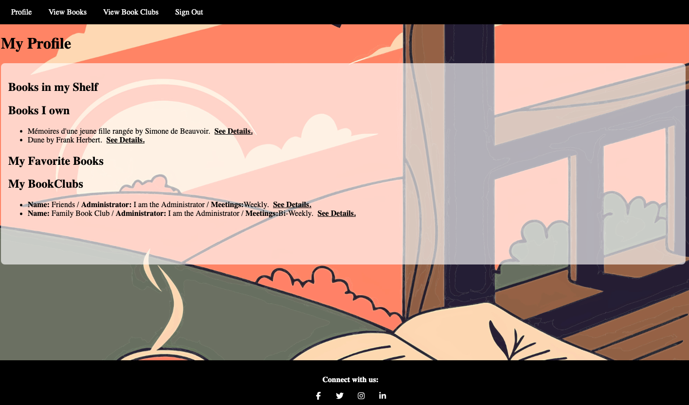
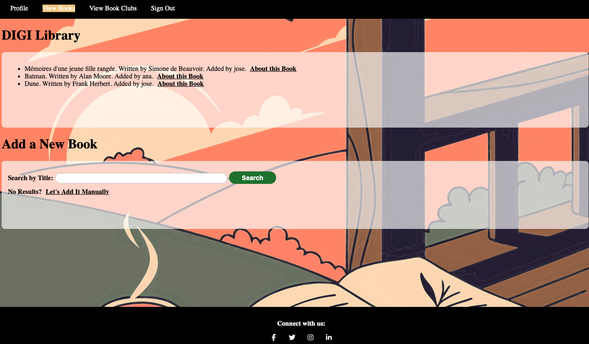
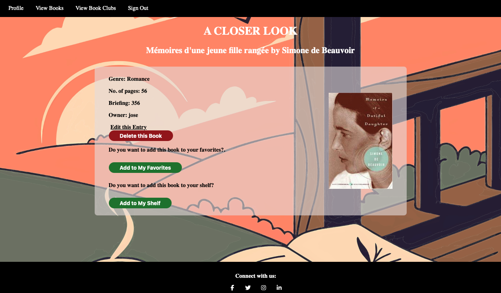
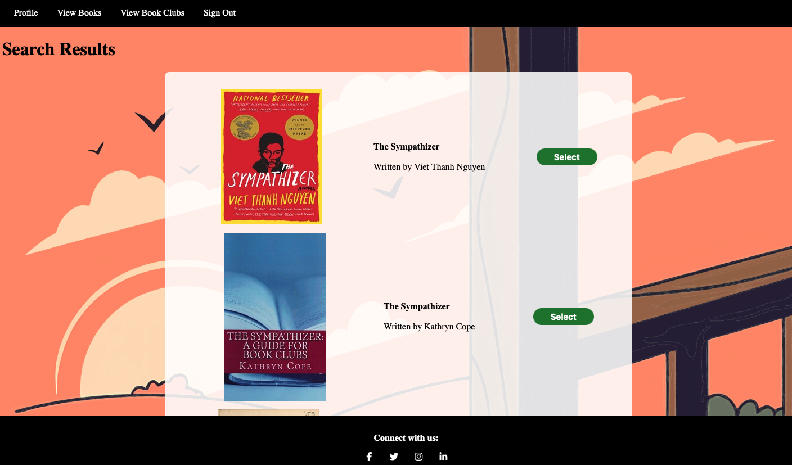
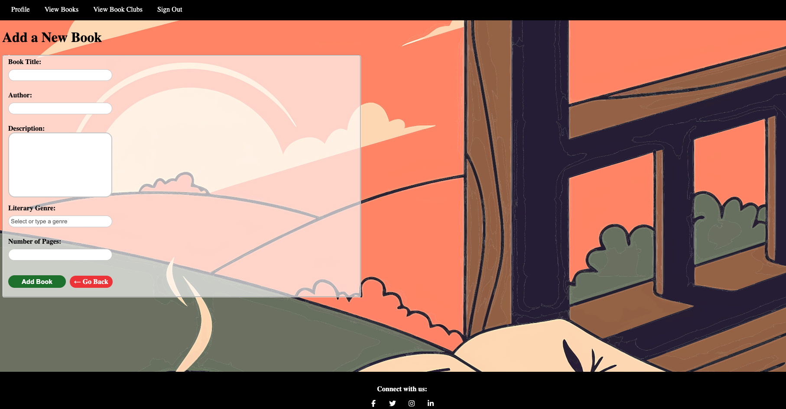
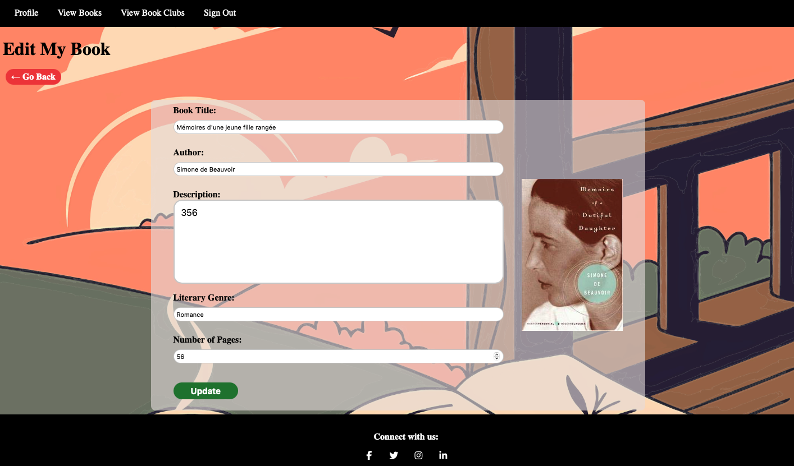
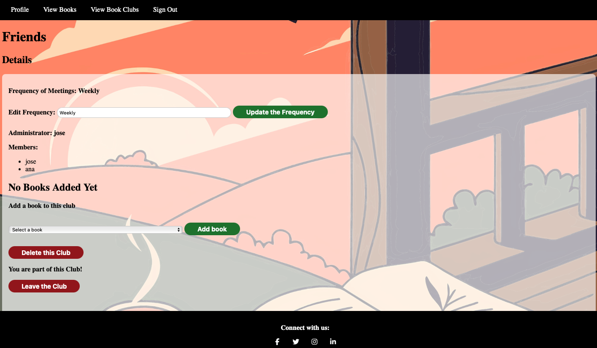
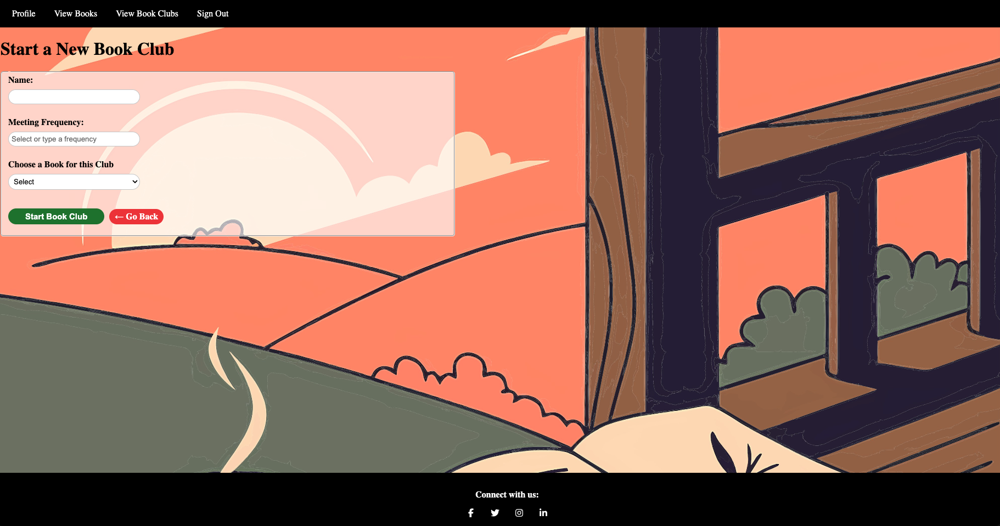

<h1 style="text-align: center;">DIGIBOOK APP</h1>

### 🔖Description
---
***DIGIAPP*** is an app where it's users can keep track of their books in a friendly way, and share them with the users community. I addition to it, they can create BookClubs that users can join to.  ***DIGIAPP*** is a fun way to manage your passion and grow your reading community.

### 📸 Screenshots
---

| Description       | Screenshot |
| :----------------:| :------:   |
| <h3 align="center">Landing Page</h3>     |      |
| <h3 align="center">Profile Page</h3>      |      |
| <h3 align="center">Books Collection</h3>       |     |
| <h3 align="center">Book Detail Page </h3>    |     |
| <h3 align="center">Add a New Book/Search </h3>   |  |
| <h3 align="center">Add a New Book/Manual </h3>   |  |
| <h3 align="center">Edit Book </h3>   |  |
| <h3 align="center">Book Clubs Lounge </h3>   |  |
| <h3 align="center">Club Details</h3> Administrator has access to edit tools  |  |
| <h3 align="center">Starting a New Club </h3>   |  |

### 👨‍💻 Getting started
---
1. **Sign Up / Sign In**  
   Create an account or log in to get started.

2. **Profile Access**  
   After logging in, the app will take you to your profile page.

3. **View Books**  
   Clicking **View Books** allows you to explore the entire book collection and add new books.

4. **Add a New Book**  
   To **Add a New Book**, you have two options:
   - Use the **Search Bar** to find and select matching books.
   - Add a book manually.

   Whichever option you choose, the page flow will guide you through the process.

5. **View Book Clubs**  
   The **View Book Clubs** page offers similar functionality with a slight difference. You can start a **New Book Club** that has access to the entire book collection and allows users to join. The **Administrator** is the only user with access to the **Edit** tools.

### :computer: Technologies Used
---

  
  
  
  
  
  
  
  
  
  
  
  

### ⏭️ Future Enhancements 
---
- Add an “Update” feature to track the reading status of a specific book (with a progress bar).
- Add a comments section to allow users to give feedback on the book.

##### Resources
---
- [Connect-flash](https://github.com/jaredhanson/connect-flash).

- [w3school](https://www.w3schools.com/)

### Let's use the App
---
Check out the following link [Digi App Deployed](https://digibook-app-5aaf094bacdd.herokuapp.com)

:rocket::boom: